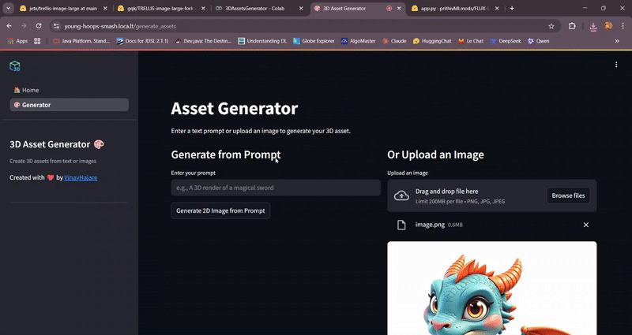

# 🚀 **Prompt-to-3D: Transform Your Ideas Into Stunning 3D Assets** 🎨


---

## ✨ Overview

**Prompt-to-3D** is an AI-powered web application that allows users to generate **high-quality 3D assets** directly from a **text prompt** or **uploaded image**.

This tool is built for creators in **gaming**, **advertising**, **product design**, **3D printing**, and **digital art**, enabling the transformation of creative ideas into real, downloadable `.glb` 3D models in just a few clicks.

---

## 🧠 Features

- ✍️ **Text-to-Image Generation**: Type in a prompt and generate a 2D base image using state-of-the-art AI models like FLUX with LoRA adapters.
- 🖼️ **Image Upload**: Start from your own image and skip the text step entirely.
- 🔁 **Prompt Enhancer**: Intelligent LLM refines your input to optimize 3D output quality.
- 🧱 **Image-to-3D Generation**: Converts 2D images to full 3D models using Hugging Face’s & TRELLIS backend.
- 🌐 **Web Interface**: Built using Streamlit for fast prototyping and user-friendly experience.
- 📥 **Download**: Export your 3D creations in `.glb` format with a single click.
- 🎥 **Interactive Viewer**: Visualize your models directly in the browser using `pyvista` + `stpyvista`.

---

## 📸 Demo



---

## 🛠️ Tech Stack

- **Frontend**: [Streamlit](https://streamlit.io/)
- **Backend**: Hugging Face `InferenceClient` + Microsoft `TRELLIS` + Hugging Face `Diffusers` 
- **Models Used**:
  - `FLUX.1`, `3D_Render_for_Flux`, `Game-Assets-LoRA`, `Isometric-LoRA`, `NFT-Art-LoRA`
- **Visualization**: `stpyvista` + `pyvista`
- **Environment Management**: `python-dotenv`

---

## 🧪 How It Works

1. **Prompt Input / Image Upload**
2. 🔍 **LLM Enhancer** (selects best model + trigger word)
3. 🖼️ **Txt2Img Generation** (via Hugging Face Diffusers)
4. 📐 **Img2-3D Conversion** (Trellis + Hugging Face)
5. 🧩 **3D Preview + Download**

---

## 🧰 Getting Started

### 1. Clone the Repository
```bash
git clone https://github.com/VinayHajare/Prompt-to-3D.git
cd Prompt-to-3D
```

### 2. Create `.env` file
```bash
touch .env
```
Add your Hugging Face token:
```
HF_TOKEN=your_huggingface_token_here
```

### 3. Install Requirements
```bash
pip install -r requirements.txt
```

### 4. Run the App
```bash
streamlit run app.py
```

---

## 📂 Directory Structure
```
Prompt-to-3D/
├── app.py                     # Streamlit navigation logic
├── 0_home.py                  # Home page with project info
├── 1_generate_assets.py       # Main functionality page
├── prompt_enhancer.py         # Prompt enhancement using LLM
├── txt2img_pipeline.py        # Text-to-Image logic
├── img2_3d_pipeline.py        # Image-to-3D via HuggingFace Space
├── util.py                    # Utility and session tools
├── requirements.txt           # Project dependencies
├── trellis/                   # Trellis Package
├── assets/
│   ├── logo.png
│   ├── demo.gif
│   └── teaser.mp4
```

---

## 🚀 Use Cases

- Game designers creating environment props and weapons
- Advertisers visualizing 3D product mockups
- 3D printing enthusiasts prototyping physical objects
- NFT creators building assets directly from text prompts

---

## 🤝 Contributors

Made with ❤️ by [Vinay Hajare](https://github.com/VinayHajare)

---

## 📄 License

This project is licensed under the MIT License.
```
